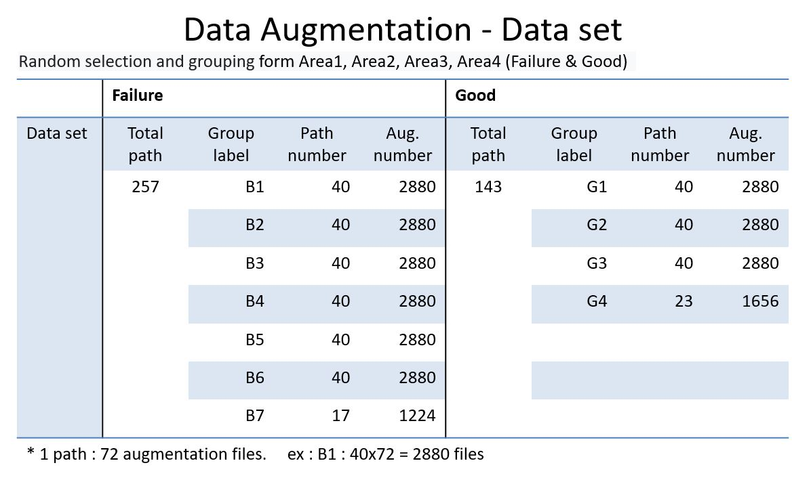
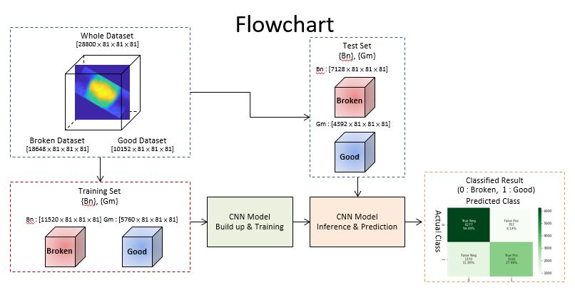
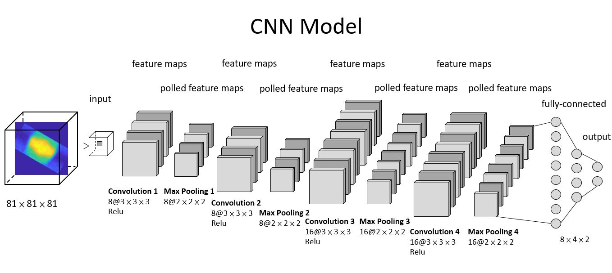
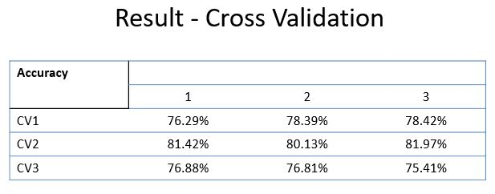

# Machine-Learning-3DIC

All 400 3D image data are randomly selected and grouped as follows, (Failure : 257 and Good : 143)

Failure data : B1(40), B2(40), B3(40), B4(40), B5(40), B6(40), B7(17)。Good data : G1(40), G2(40), G3(40), G4(40).

Data Augmentation :

According data augmentation, the data set of 400 3D images can be expanded into 28800 :

Download the data set of 28800 3D images :

https://drive.google.com/drive/folders/1-FB62wS0pXGbNby_2NSgi40pHn6_bqnB?usp=sharing

(Failure data : augbroken1-7. Good data : auggood1-4. Failure label: augbrokentype1-7. Good label : auggoodtype1-4.)

Cross-Validation

TrainingModel_CrossValidation_1, 2, 3 are 3 fold cross-validation.

The following is the CNN flowchart and model architecture :

After three cross-validations, the accuracy of the test set are shown in the table : 

